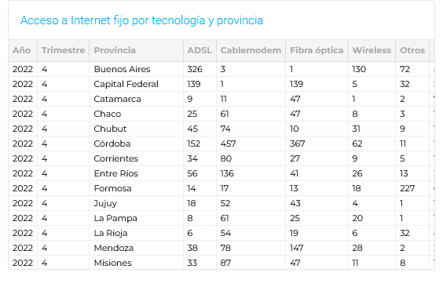
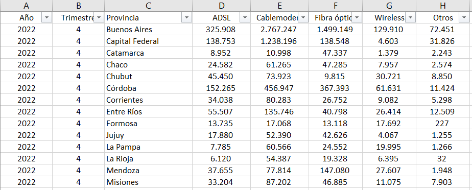

<h1>
PROYECTO INDIVIDUAL N°2 
 
Telecomunicaciones y Conectividad
</h1>
En el contexto del rápido crecimiento de las telecomunicaciones, las empresas prestadoras de servicios deben contar con herramientas y recursos que les permitan tomar decisiones estratégicas. Así la analítica de datos juega un papel fundamental, ya que permite identificar patrones y oportunidades que suelen pasar desapercibidos.

## 👀 EXPECTATIVAS 
Se nos presenta el desafío de suponer que trabajamos para una empresa de telecomunicaciones en un rol de *data analyst*, debiendo trabajar el [dataset proporcionado](https://datosabiertos.enacom.gob.ar/dashboards/20000/acceso-a-internet/). Tenemos libertad para trabajar los datos y ampliar el mismo con información que consideremos relevante.

Por mi parte, considero que un correcto análisis se basa en:
+ Recopilación de datos.
+ Limpieza y preparación de datos.
+ Análisis de datos.
+ Presentación de resultados.

Si los datos y el tiempo lo permiten, sería interesante, también incluir:
+ Análisis de comportamiento de los usuarios.
+ Análisis de la competencia.
+ Análisis de tendencias tecnológicas.

## 📂 DATASET
Los datos que nos fueron proporcionados hablan de `acceso a internet` y contienen `información de mercado, oferta, demanda y cobertura de los servicios de comunicaciones (2022)`. Estos, pueden obtenerse mediante una API o ser descargados en .csv, sin embargo, fueron trabajados por ENACOM de forma incorrecta generando datos inconsistentes.

Podemos darnos cuenta en éste simple ejemplo.
Esta imagen es extraída de un cuadro brindado por ENACOM y son los mismos datos que tomaríamos desde la API o .csv.

He encontrado, también en la página de ENACOM, la fuente en la cual se basan para realizar dichos cuadros y se nota la diferencia.

Puedo llegar a la conclusión de que al momento de trabajar los datos, confunden los *separadores de millares* con *separadores decimales*. Y, en función de evitar datos erróneos, he decidido trabajar sobre los .xlsx originales que utilizaron para crear la api provista.

Obteniendo así, los siguientes archivos para el análisis:
-   Internet_Penetracion.xlsx
    - Número de accesos al servicio de Internet fijo por cada 100 hogares por provincia.
-   Internet_BAF.xlsx
    - Número de accesos al servicio de Internet fijo por banda ancha y banda angosta en cada provincia (trimestral).
-   Internet_Accesos-por-tecnologia.xlsx
    - Número de accesos al servicio de Internet fijo por tipo de tecnología en cada provincia (trimestral).
-   historico_velocidad_internet.xlsx
    - Serie histórica de la velocidad media de descarga de Internet por provincia (trimestral).
-   Internet_Accesos-por-velocidad.xlsx
    - Número de accesos al servicio de Internet fijo por velocidad de bajada en cada provincia (trimestral).
-   Internet_Accesos-por-velocidad_provincia_sin rangos.xlsx
    - Número de accesos al servicio de Internet fijo por velocidad de bajada en cada provincia.
-   Internet_Ingresos.xlsx
    - Ingresos trimestrales de los operadores por el servicio de Internet fijo.
-   Internet_Accesos-por-velocidad_por loc.xlsx
    - Número de accesos al servicio de Internet fijo por velocidad de bajada en cada localidad declarada.
-   Internet-Accesos-por-tecno_por_loc.xlsx
    - Número de accesos al servicio de Internet fijo por tecnología en cada localidad declarada Categoría.
-   mapa_conectividad.xlsx
    - Listado de localidades con conectividad a internet, con detalle por tipo de conexión.

## 🔍 ANÁLISIS
Las conclusiones que podemos sacar del análisis realizado son:
-	A nivel nacional los accesos a internet fijo cada 100 personas se concentran en un rango donde la media avanza de **11,06** (2014), hasta llegar a **20,05** (2022) notando un avance en la conectividad. Se puede exponer que CABA en todo momento se mantiene como el sector con mas accesos **43,11** (2014), hasta llegar a **49,11** (2022) estando muy por arriba de las demás provincias. Pero si al análisis lo tratamos como porcentajes de crecimiento, CABA es la que menos ha avanzado solo con un **13,93**% en 8 años, mientras que el promedio nacional ronda el **81,36**% en la misma cantidad de años.
-	Las provincias con mas conexiones, como era de esperar, son Buenos Aires, CABA, Córdoba y Santa Fe ya que integran los [principales centros urbanos](https://www.argentina.gob.ar/pais/poblacion/centros) de Argentina según INDEC.
-	El avance de la banda ancha sobre la banda angosta es evidente, las viejas instalaciones ADLS están siendo remplazadas por fibra óptica y conexiones de alta velocidad. Se observa un punto de quiebre entre 2017 y 2018 donde también se aprecia el aumento de velocidad de las conexiones. Justamente esta mejora coincide con la [fusión]( https://www.enacom.gob.ar/institucional/enacom-aprobo-la-fusion-de-telecom-de-argentina-s-a--y-cablevision-s-a-_n1838) de 2 grandes empresas de telecomunicaciones en Argentina.
-	Los ingresos relacionados a servicio de internet, al ser graficados, presentan un aumento constante. A través de cruces de información, he podido demostrar que los ingresos son claramente influenciados por la inflación que atraviesa Argentina.

## 🚥  KPIs
El año 2020 estuvo marcado por la pandemia de COVID-19, que tuvo un impacto significativo en todos los ámbitos de la sociedad. En el sector de las telecomunicaciones, el confinamiento domiciliario y la creciente demanda de servicios en línea impulsaron el crecimiento de la conectividad.

### Acceso al servicio de internet fijo por hogares
El KPI establecido era el `aumento de un 2% en accesos al servicio de internet fijo por cada 100 hogares por provincia para diciembre de 2020`. Sin embargo, a medida que el año llegaba a su fin, los datos del 4t 2020 revelaron un escenario dispar: un buen desempeño en varias provincias contrastado con un pobre rendimiento en otras. A pesar del esfuerzo, no se logró alcanzar la meta en su totalidad, evidenciando la diferencia de servicio en distintas regiones del país.

### Cobertura nacional de accesos al servicio de internet
El KPI propuestos hace cinco años era `alcanzar un 80% de cobertura nacional en los accesos al servicio de Internet fijo para finales de 2020`, independientemente de la tecnología utilizada. En un resultado alentador, este objetivo se cumplió sin inconvenientes. Este logro marcó un hito significativo en la conectividad a nivel nacional, brindando oportunidades de acceso a un número considerable de argentinos.

### Reducción de costos del servicio
El KPI se centraba en la `reducción de los costos del servicio (al menos un 10%) con respecto al mismo trimestre 2017`, buscando controlar si la fusion telecom-cablevision realizada en ese año realmente fue positiva o abusaron de su posision en el mercado. Cabe destacar que [la fusion (2017) concentra]( https://chequeado.com/el-explicador/fusion-telecom-cablevision-que-implica-y-como-se-llego-a-la-situacion-actual/) el 42% de la telefonía fija; el 34% de la telefonía móvil; el 56% de las conexiones a internet por banda ancha fija; el 35% de conectividad móvil; y el 40% tv paga. Por esta situacion, se llevó a cabo un análisis que involucró la correlación de los precios en pesos, teniendo en cuenta la inflación en Argentina y el valor del dólar. Los resultados fueron aceptables, ya que se logró cumplir este objetivo, proporcionando un servicio más accesible a los usuarios y adaptándose a las condiciones económicas cambiantes del país.

El período comprendido entre 2015 y finales de 2020 marcó un hito en el desarrollo de las telecomunicaciones en Argentina. A pesar de desafíos como la disparidad en la penetración del servicio en diferentes provincias, el logro de una cobertura nacional del 80% y la reducción de costos son testigos del progreso significativo en la conectividad. Este viaje no solo se trata de números, sino del compromiso continuo para garantizar una conectividad inclusiva y asequible para todos los argentinos.

## 💻 TECNOLOGÍAS
El proyecto fue implementado en Python, haciendo uso de diversas bibliotecas especializadas para llevar a cabo tareas específicas. A continuación, se detallan las librerías utilizadas:

+ Pandas: Esta biblioteca fue empleada para el procesamiento de datos, brindando funcionalidades que facilitan la carga y manipulación de información en formato tabular.

+ Matplotlib: La visualización de datos se llevó a cabo con Matplotlib, una biblioteca que proporciona herramientas gráficas para crear gráficos y visualizaciones detalladas.

+ Seaborn: Además, Seaborn se empleó en conjunto con Matplotlib para mejorar la estética y funcionalidad de los gráficos, ofreciendo una capa de abstracción adicional.

Además, los datos trabajados serán presentados mediante Power BI, que ofrece herramientas avanzadas de visualización y análisis que facilitarán la interpretación de los datos, proporcionando una comprensión más clara y detallada de los resultados.

## 📰 Fuentes de datos

[Dataset provisto.](https://datosabiertos.enacom.gob.ar/dashboards/20000/acceso-a-internet/)

[Dataset utilizado (original).](https://datosabiertos.enacom.gob.ar/dashboards/20000/acceso-a-internet/)

[Principales centros urbanos.](https://www.argentina.gob.ar/pais/poblacion/centros)

[Índice de precios al consumidor.](https://www.indec.gob.ar/indec/web/Nivel4-Tema-3-5-31)

[Tipo de Cambio BNA (Vendedor).](https://datos.gob.ar/series/api/series/?ids=168.1_T_CAMBIOR_D_0_0_26&limit=5000&representation_mode=value&chartType=column&collapse=quarter&collapse_aggregation=end_of_period)

[Fusión Telecom-Cablevisión: qué implica.](https://chequeado.com/el-explicador/fusion-telecom-cablevision-que-implica-y-como-se-llego-a-la-situacion-actual/)

[Enacom aprobó la fusión de Telecom y Cablevisión.](https://www.enacom.gob.ar/institucional/enacom-aprobo-la-fusion-de-telecom-de-argentina-s-a--y-cablevision-s-a-_n1838)

-----------

